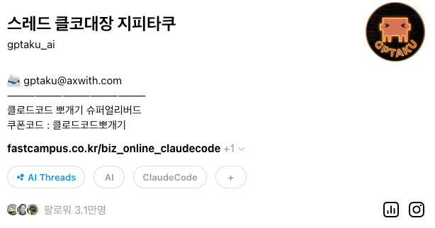

<!-- _class: banner -->

[ 윤자동 원데이클래스 ]

# 윤자동 원데이클래스 Ch0 — 오리엔테이션 2026.05.09 (토) · 클로드코드로 나만의 AI 비서 만들기

By. 이철로 (지피타쿠)

<!--
Speaker note:
안녕하세요. 지피타쿠입니다.
오늘 6시간 (점심 1시간 별도) 동안 함께할 윤자동 원데이클래스에 오신 걸 환영합니다.
본격적인 실습 들어가기 전에 오리엔테이션 + 환경 셋업부터 진행하겠습니다.
-->

---

<!-- _class: hero -->

# 이철로 <strong>지피타쿠</strong> — 클코대장

- 현) <strong>AX with</strong> — AX 컨설팅 & AI 교육 설계
- 현) <strong>1인 개발자</strong> — AI 기반 서비스 개발
- 전) <strong>R&D 메카니컬 엔지니어 10년</strong>
  (GENTLE MONSTER, LG INNOTEK 등)

10년 R&D 엔지니어가 <strong>클로드코드 만나고 일을 바꿨거든요</strong>

<!--
Speaker note:
스레드에서 '클코대장 지피타쿠'로 활동하고 있는 이철로입니다.
팔로워 3.1만 — 클로드코드 콘텐츠로 모인 분들입니다.

10년간 메카니컬 엔지니어로 연구개발을 했어요. 엔지니어 = 문제 찾고, 원인 분석하고, 개선하는 일.
그래서 생산성 개선·새 공정에 관심이 많았고, AI도 남들보다 먼저 써봤습니다.

클로드코드로 업무 자동화·자재관리 시스템을 코드 없이 만들어 실무에 적용했어요. 전부 대화만으로.
그게 트리거였어요. 10년 커리어를 내려놨습니다.
-->

---

<!-- _class: peak -->

강의 끝나면 따라쳤던 게 다 사라지지 않습니다

# 내 자료·내 업무가 박힌 AI 에이전트를 가져갑니다

오늘 끝에 손에 쥐는 것 = <strong>내 워크스페이스 1개</strong>

<!--
Speaker note:
대부분의 강의는 끝나면 따라쳤던 게 다 사라져요.
오늘은 다릅니다.

내 자료, 내 사업의 반복 업무, 내 톤이 박힌 AI 에이전트 워크스페이스 1개를 가져가실 거예요.
강의 끝난 다음 날부터 매일 쓰는 도구가 됩니다.

오늘의 진짜 결과물은 강의실 안에서 만드는 게 아니라, 강의실 떠난 후에 매일 작동합니다.
-->

---

<!-- _class: title-lock -->

# 10:00~17:00 — 실강 6H + 점심 1H

10:00 — 10:30

Ch0 오리엔테이션 + 셋업

alias · hook · mode 셋업

10:30 — 12:00

Ch1·2·3 오전 — 같이 만들기

차트·보고서·HTML 대시보드 / 카드뉴스 / 공개 URL

12:00 — 13:00

점심

—

13:00 — 14:30

Ch4·5·6 도구 + 스킬

플러그인 4종 / 블로그 자동화 + 본인 스킬

14:45 — 16:30

Ch7 본인 워크스페이스

★ 내 사업 AI 에이전트

16:30 — 17:00

공유 · 마무리

1분 시연 × 7명

<!--
Speaker note:
오늘 시간표 한 장.

오전 (Ch0~3): 환경 셋업 + 강사 시연 따라치기 — 차트·보고서·대시보드, 카드뉴스, 포트폴리오 + Vercel 배포까지.
오후 (Ch4~7): 플러그인 깔고, 스킬 직접 만들고, 본인 워크스페이스까지.

오늘 끝나면 손에 쥐는 거 — 결과물 4개 + 본인 사업 워크스페이스 + 본인 스킬 1~2개.
오늘의 메인은 14:45 부터 16:30 까지의 Ch7 — 본인 워크스페이스 빌드입니다.
-->

---

<!-- _class: title-lock -->

# Ch0 — 환경 셋업 5 STEP 강사 시연 → 같이 따라치기

1

오리엔테이션

지금 보고 계신 슬라이드

2

alias 셋업

매번 'claude' 풀입력 줄이기

cc · ccd · ccr

3

Hook + env 셋업

Stop hook 사운드 / 위험 명령 차단 / Agent Teams 환경변수

4

모드 셋업

Auto 모드 (Pro 사용자 → Accept-edits)

Shift + Tab

5

환경 점검 + Ch1 진입

셋업 확인 후 첫 응답 받아보고 Ch1 으로

각 STEP 끝마다 <strong style="color:#FC1C49;">"다음"</strong> 입력 → 다음 단계로

<!--
Speaker note:
오리엔테이션 = 환경 셋업입니다. 5 STEP 진행해요.

1. 인사 + 오늘 흐름 — 지금 보고 계신 슬라이드
2. alias 셋업 — claude 명령을 cc 한 글자로 줄이기
3. Hook + env 셋업 — 작업 끝나면 사운드, rm 같은 위험 명령 차단, 그리고 오후 Agent Teams 환경변수
4. 모드 셋업 — Auto 모드 (Pro 사용자는 Accept-edits)
5. 환경 점검 + Ch1 진입

각 STEP 끝나면 "다음" 입력하시면 됩니다. 강사가 먼저 시연하면 같은 명령 그대로 따라치세요.
-->

---

<!-- _class: title-lock -->

# 시작하기 워크스페이스 다운 → /yjd-ch0

STEP 1 · WORKSPACE

yjd-cc 워크스페이스 다운받기

github.com/ fivetaku/yjd-cc

<ol style="font-size:18px; color:#1d242f; line-height:1.65; margin:0; padding-left:22px;">
<li>위 페이지 접속</li>
<li>초록색 <strong style="color:#FC1C49;">Code</strong> 버튼 → <strong>Download ZIP</strong></li>
<li>압축 해제 → <strong>~/Desktop/yjd-cc</strong></li>
<li>안티그래비티에서 폴더 열기</li>
</ol>

STEP 2 · CLAUDE CODE

스킬이 5 STEP 안내해줍니다

/yjd-ch0

→ alias · hook · mode 셋업까지 자동으로 안내

<!--
Speaker note:
지금 바로 시작합니다. 안티그래비티 환경에서 진행하니까 터미널 cd 명령은 필요 없어요.

먼저 yjd-cc 워크스페이스를 다운받습니다 — git clone 한 줄. 깃이 없으신 분은 GitHub 페이지에서 zip 다운도 OK.
다운받은 폴더 (~/Desktop/yjd-cc) 를 안티그래비티에서 열고, 그 안에서 클로드코드 실행하세요.

켜진 후 /yjd-ch0 입력. 스킬이 5 STEP 차례로 안내합니다.
-->

---

<!-- _class: peak -->

셋업 끝나면 바로 →

# /yjd-ch1

데이터 → 차트 → 보고서 → <strong>HTML 대시보드</strong>

<!--
Speaker note:
오리엔테이션 + 환경 셋업이 끝나면 자연스럽게 Ch1 으로 넘어갑니다.

10:30 부터 본격 실습 시작 — 데이터 분석 + 차트 + 차트 임베드된 임원 보고서 + 인터랙티브 HTML 대시보드 한 번에 만들어볼 거예요.

자, 시작합니다.
-->
